## Study objective

KIDMO is a **clinical prediction model** to estimate **graft loss** risk in deceased-donor kidney transplantation. It uses a combination of

* **donor** and
* **recipient** clinical characteristics.

### Goal

Inform clinicians and patients of individual **outcome risks** at the time of organ offer to support **decision-making** and improve outcomes.

Clinical prediction models play a vital role in advancing **personalized medicine**.

## Design, participants, setting and outcome

|               |                                                                        |
|---------------|------------------------------------------------------------------------|
| *Design*      | National multi-center retrospective cohort study.                      |
| *Participants*| All deceased-donor kidney transplant recipients from 2008 to 2021.|
| *Setting*     | Six Swiss transplant centers: Basel, Bern, Geneva, Lausanne, St. Gallen, and Zurich.|
| *Primary Outcome* | Time to graft loss (interval from transplantation to irreversible graft failure). Patient death was treated as a **competing risk**.|

## Swiss transplant centers

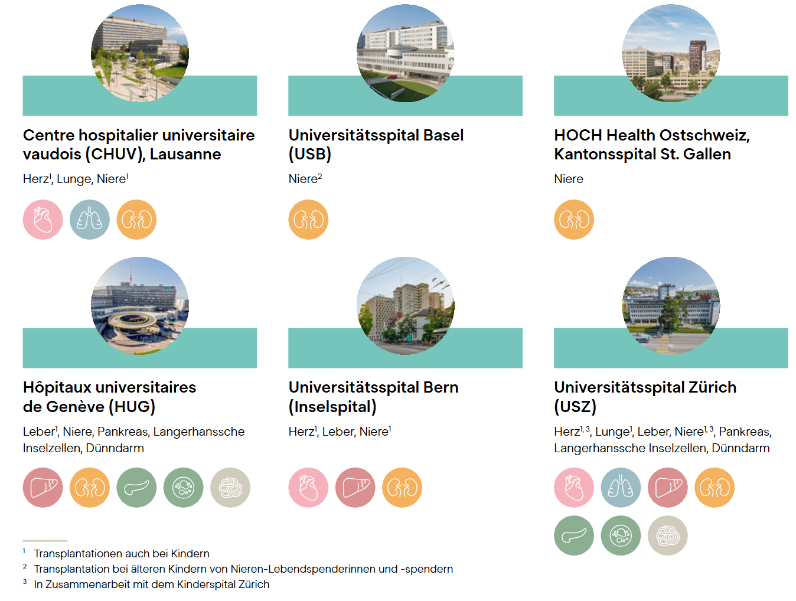{width=100%}

## Methods

* Competing risk regression (Fine & Gray model)
* Non-linear modelling (restricted cubic splines)
* Model performance: C-statistic, area under the curve (AUC), Brier score, calibration plot, calibration in-the-large, calibration slope
* Internal validation and optimism correction (bootstrapping with B=1,000)
* Internal-external cross-validation
* Clinical utility (decision curve analysis and net benefit)

## Study protocol

:::: {.columns}

::: {.column width="50%"}

We published a study protocol.^[Schwab et al. 2023, *Diagn Progn Res*]

* Prespecified predictors
* Sample size calculation^[Riley et al. 2020, *BMJ*]
+ N=2,042 recipients
+ 167 events
+ 19 parameters (16 variables)
+ EPP 8.8
* Statistical analysis plan

:::

::: {.column width="50%"}

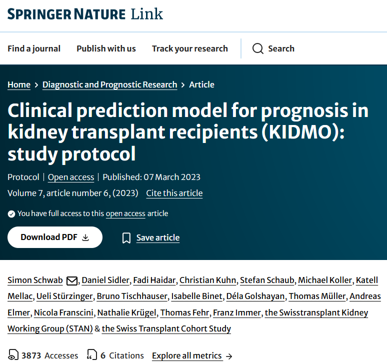{width=100%}

:::

::::

## Participant flow

:::: {.columns}

::: {.column width="40%"}

**87% of the population** in the model development.

*Exclusion:*

* 10.1% with no consent
* 2.9% missing data

*Dropouts (were censored):*

* 34 (1.4%) dropouts
* 33 moved away
* 1 other reason

:::

::: {.column width="60%"}

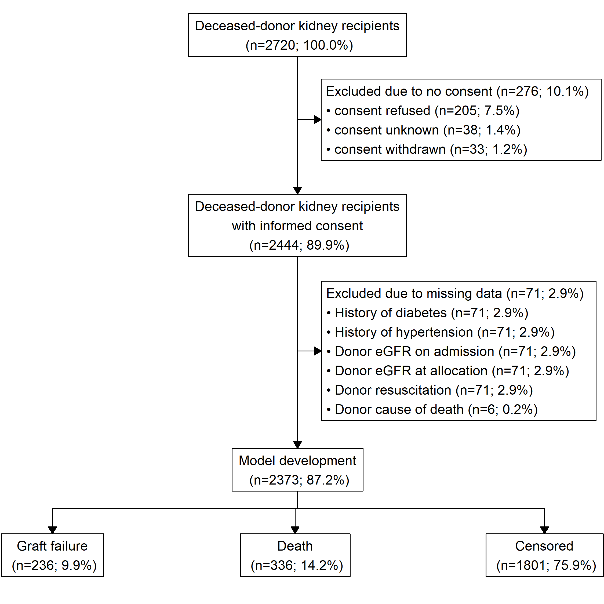{width=90%}

:::

::::

## Receipient and donor characteristics {.nostretch}


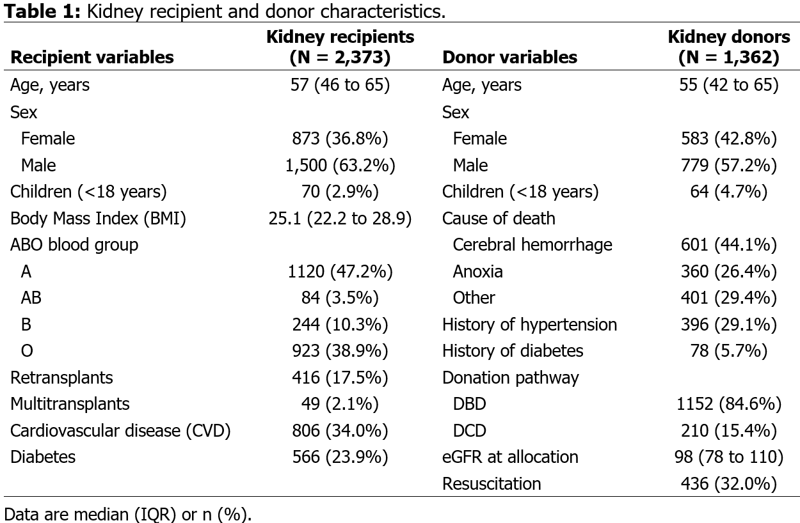{width=70%}

## Cumulative incidence


Probability of an event by time *t* (with 95% confidence bands).

:::: {.columns}

::: {.column width="30%"}

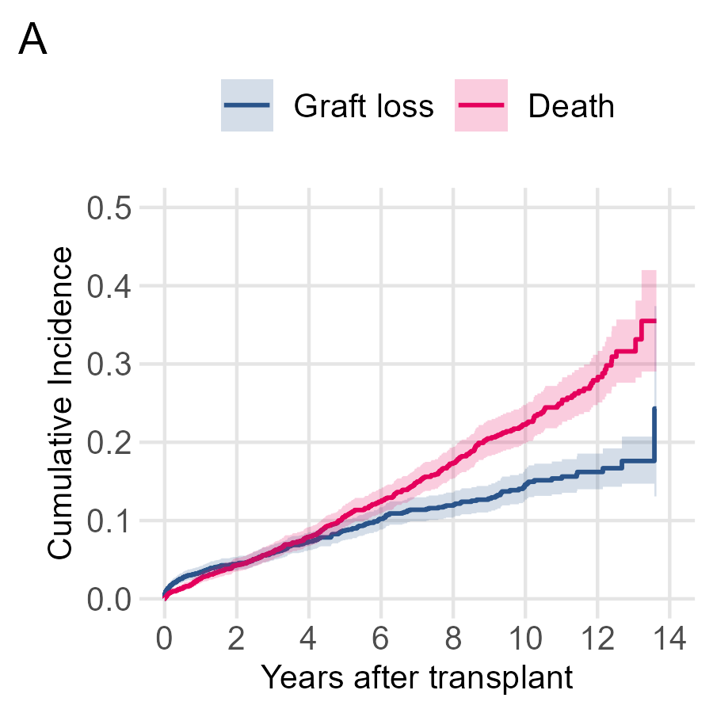{width=100%}

:::

::: {.column width="70%"}

::: {style="font-size: 80%;"}

| Outcome     | 2-years            | 5-y years            |
|-------------|--------------------|----------------------|
| Graft loss  | 4.4% (3.6--5.3)   | 8.7% (7.4--10.0)   |
| Death       | 4.3% (3.5--5.2)   | 10.4% (9.0--11.9) |

:::

:::

::::

## Full model

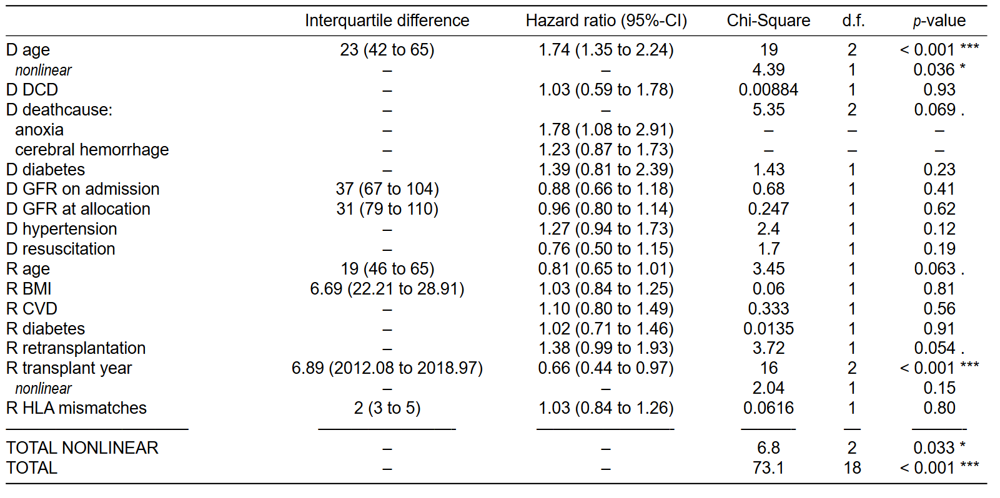{width=83%}

* 15 Predictor variables altogether
* [--recipient DSA, --recipient time on dialysis]
* [+transplant year]

## Variable selection

* Backward elimination with AIC (*p*&asymp;0.157) across 1,000 bootstrap samples^[Heinze & Dunkler, 2017, *Transpl Int*]
* Selection criterion: variables contained in at least 50% of the reduced models

&rarr; Entire model-building process was repeated within each bootstrap

### Final model

* 7 variables
+ 4 donor variables
+ 3 recipient variables

## Final model

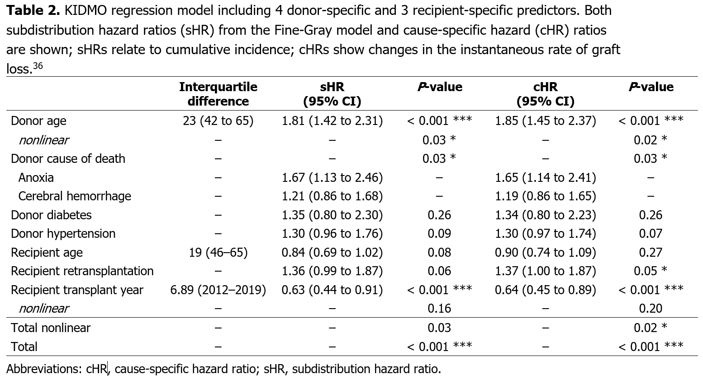{width=90%}

Not all predictors are *statistically significant* and that is okey!

## Partial effects

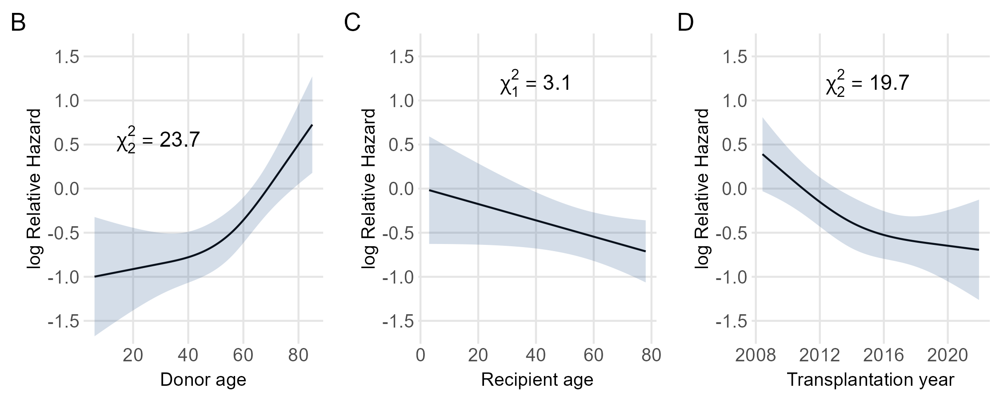{width=100%}

Partial effects of the continuous variables (B) donor age, (C) recipient age, and (D) transplantation year on the graft loss rate.


## Model equation

Uer the Fine–Gray formulation, the subdistribution hazard leads to the following expression for the graft-survival function:

$$\Pr(T\geq t~|~X) = S_{0}(t)^{\mathrm{e}^{X\beta}},$$

where $S_{0}(t)$ denotes the baseline survival function. Baseline survival values used for prediction are provided in the table below for the clinically relevant time points $t = 2$ and $t = 5$ years.

| $t$ |$S_{0}(t)$|
|-----|----------|
| 2   | 0.9594   | 
| 5   | 0.9225   | 

## Linear predictor

The term $\mathrm{e}^{X\beta}$ is the individual-specific subdistribution hazard ratio derived from the linear predictor $X\hat{\beta}$ shown below.

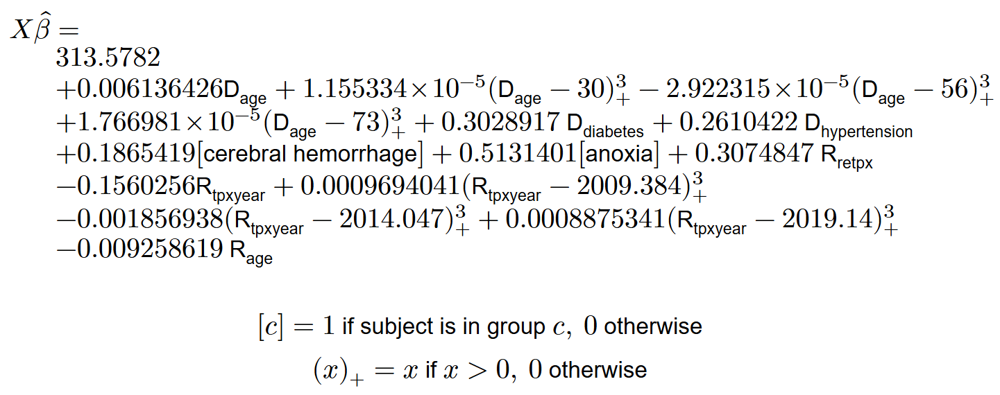{width=100%}

## Absolute risks

The cumulative incidence, i.e., the probability of graft loss by time $t$ for an individual with covariates $X$, is

$$
F(t~|~X) = 1 - S_{0}(t)^{\textrm{e}^{X\beta}},
$$

where

* $S_0(t)$ is the baseline graft survival function at time $t$, and
* $\textrm{e}^{X\beta}$ is the hazard ratio, obtained from the linear predictor.

Accordingly, the cumulative incidence at 2 and 5 years after transplant is given by:

* 2-year risk: $F(t = 2 | X) = 1 - S_{0}(2)^{\textrm{e}^{X\beta}}$ = $1 - \textrm{0.959}^{\textrm{e}^{X\beta}}$,
* 5-year risk: $F(t = 5 | X) = 1 - S_{0}(5)^{\textrm{e}^{X\beta}}$ = $1 - \textrm{0.922}^{\textrm{e}^{X\beta}}$.

## Implementation in Swisstransplant package `swt`

The KIDMO risk score has been implemented in the Swisstransplant R package `swt`.

* <https://data.swisstransplant.org/tools/> 
* enable easy calculation of the KIDMO score (among other stuff)

```r
remotes::install_github("Swisstransplant/swt")
```

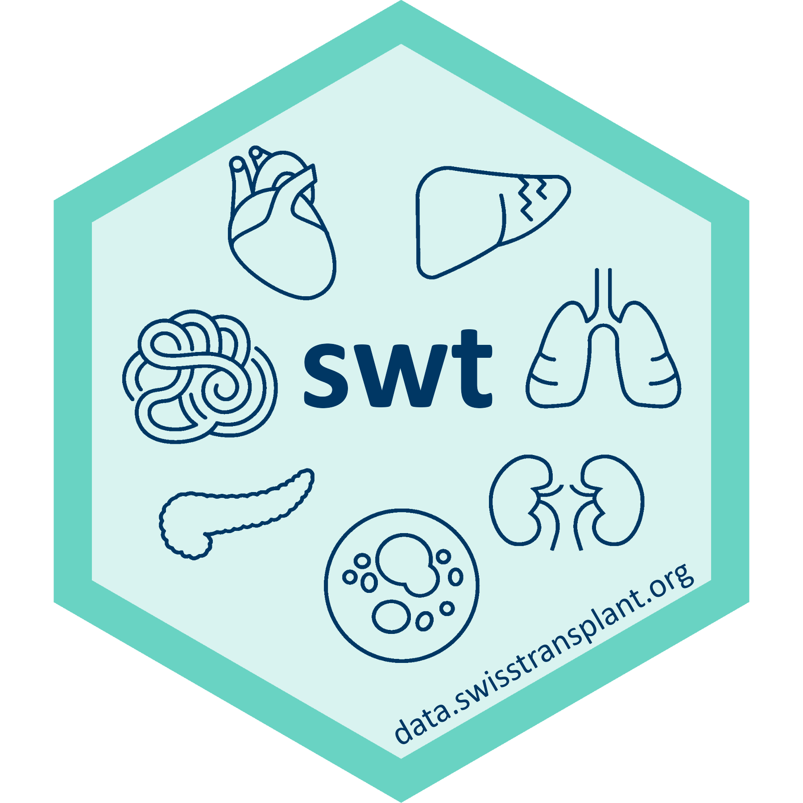{width=100%}


## `kidmo()` function

:::: {.columns}

::: {.column width="40%"}
### Usage

```{r}
#| echo: true

library(swt)

kidmo(D_age = 45,
      D_deathcause = "anoxia",
      D_diabetes = TRUE,
      D_hypertension = TRUE,
      R_age = 50,
      R_retpx = TRUE,
      R_tpxyear = 2026)
```
:::

::: {.column width="60%"}

### Option `newdata`

```{r}
#| echo: true

data = data.frame(D_age = 45,
                  D_deathcause = "anoxia",
                  D_diabetes = TRUE,
                  D_hypertension = TRUE,
                  R_age = 50,
                  R_retpx = TRUE,
                  R_tpxyear = 2026)

stats = kidmo(newdata = data)
stats
```
:::

::::

## Behind the scenes

1. Model fit is stored as internal data in `sysdata.rda`<br>(`cph` object from `rms`)

```r
# Quality checks: don't save sensitive data
idat.kidmo.model$x = NULL
assert(is.null(idat.kidmo.model$x))

usethis::use_data(
  idat.kidmo.model,
  internal = TRUE, overwrite = TRUE
)
```

* Careful not to leak any patient level data!

2. Write function to access internal data
* use `predict()` and calculate relative and absolute risks

3. Double check, double check, double check

* Technical documentation with example calculation

## Plots

```{r}
#| echo: true

data = data[rep(1,4), ]
data$D_age = c(25, 45, 65, 85)

stats = kidmo(newdata = data)
stats$summary
```

## Plots

The returned object also includes the cumulative incidence curves.

```{r}
#| fig-width: 3
#| fig-height: 3
#| fig-cap: "Cumulative incidence curves for recipients of kidneys from donors of varying ages, all other factors being equal."

col = swt::swt_colors()
fs = 0.8 # font size

par(mar = c(4.5, 4.5, 1.5, 1), mgp = c(2, 0.7, 0), bty = "n")
plot(x = stats$CI.time, y = stats$CI[1,], type="s", 
     col = col$blue.alt, cex.main = fs, cex.lab = fs, cex.axis = fs,
     ylim = c(0, 0.5), xlim = c(0, 5),
     main = "Varying donor age",
     ylab = "Cumulative incidence",
     xlab = "Time since transplant (in years)")

lines(stats$CI.time, stats$CI[2,], col = col$strongred.akzent)
lines(stats$CI.time, stats$CI[3,], col = col$turkis.tpx)
lines(stats$CI.time, stats$CI[4,], col = col$green.pancreas)

legend("topright", legend = c("85 years", "65 years",
                              "45 years", "25 years"),
       col = c(col$green.pancreas, col$turkis.tpx,
               col$strongred.akzent, col$blue.alt),
       lty = 1,  lwd = 2, bty = "n", cex = fs)
```

## Online calculator

Runs on psot connec clouse
Quarto website that implements app with iframe

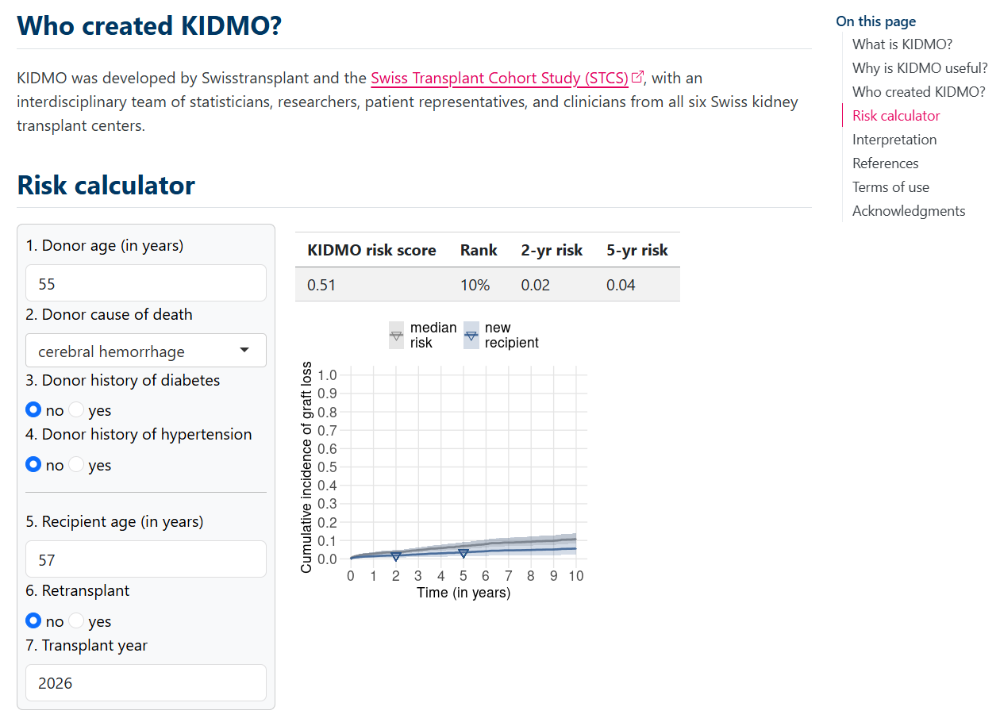{width=100%}